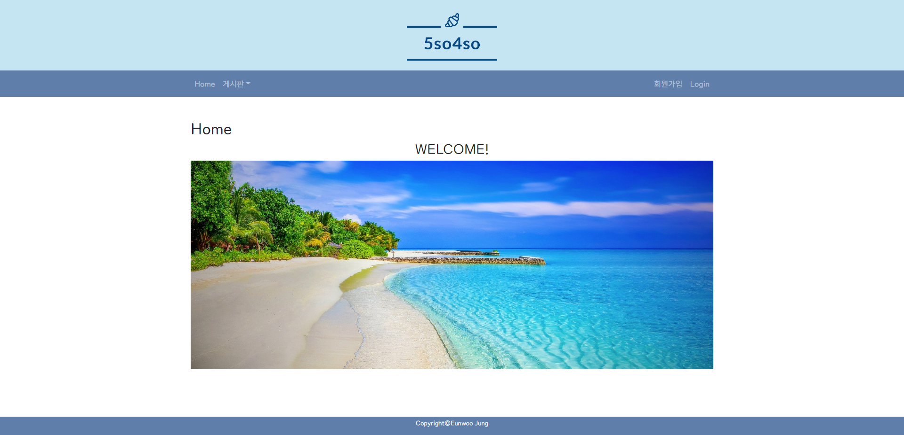

# README.md

---

# Bulletin Board System

React와 SpringBoot를 이용한 게시판 만들기

Front-end Repository : [https://github.com/jungeu1509/bit-bbs_front_repo](https://github.com/jungeu1509/bit-bbs_front_repo)
Back-end Repository : [https://github.com/jungeu1509/bit-bbs_back_repo](https://github.com/jungeu1509/bit-bbs_back_repo)

## 사용설명

### 메인화면(Home)

- 로그인 후 메인화면

    

- 메인화면 드랍메뉴

    

### 게시판 목록

### 게시물 쓰기

- 로그인 상태에서만 작성가능
- 제목, 내용 작성 가능
- 취소 버튼 선택시 글 목록 이동
- 제목, 내용 5자 이상 작성 후 글쓰기 버튼 선택 가능

### 게시물 보기

- 로그인 상태에서만 글 읽기 가능
- 동일한 로그인 아이디로 조회해도 20분 동안 조회수 오르지 않음(20분 후 글 봤을 경우 조회수 상승)
- 글목록 돌아가는 버튼
- 새글쓰는 버튼
- 답글쓰는 버튼

- 본인 글 접근 시 수정하기 버튼, 삭제하기 버튼 활성화

- 댓글 입력가능
- 댓글 총 개수 확인가능
- 댓글 번호,
- 로그인 상관없이 댓글의 id, 내용 작성 후 등록 가능

### 게시물 수정

- 본인 게시물만 게시물 수정 가능
- 취소 버튼 클릭시 상세글로 돌아감
- 수정하기 버튼 클릭시 수정여부 확인 후 수정

### 게시물 답글 쓰기

- 로그인 후 답글 작성 가능
- 페이지에서 원본글 확인 가능

- 제목과 내용 작성 후 답글쓰기 버튼 가능
- 취소버튼 클릭시 원본 글 보기 화면으로 이동

### 마이페이지

- 로그인 해야 접속 가능
- 아이디, 이름, 이메일 확인 가능

### 로그인

- 아이디, 비밀번호 입력해야 로그인 가능
- 로그인 성공 후 메인화면으로 이동

### 회원가입

- ID 중복체크, EMAIL 중복체크 확인 시 입력칸 비활성화 및 회원가입 버튼 활성화
- 4개 항목 중 하나라도 미입력시 회원가입 불가.
- 취소시 메인화면으로 이동

### 기타기능

- 로고 클릭시 메인화면으로 이동
- 스크롤 아래로 내리면 우측 하단에 고정된 TOP 버튼 생성 TOP버튼 클릭시 맨 위로 이동
- favicon 적용
- TmoneyRoundWind 글씨체 적용
- 테마색 적용

## 개발

### ****Entity Relationship Diagram****

## 회고

- Liked
    - 프런트와 백엔드를 다 작업해서 전체적인 동작흐름을 이해하기 쉬웠다. 개인 페이지를 제작할 수 있다는 자신감을 얻었다.
- Learned
    - 리액트를 해보며 많은 것을 배웠다. 상위 컴포넌트와 하위 컴포넌트에서 데이터를 이동시키는 과정을 많이 해보며 동작과정을 많이 이해했다. 특히 로그인 데이터를 이동하며 많이 적용했다. 파라미터를 이용해 하위로 전달하고 콜백함수를 이용해 상위 컴포넌트를 사용했다.
- Lacked
    - 시간이 부족해서 조금더 섬세한 작업을 못해서 아쉽다. 프런트의 경우 회원가입시 예외처리를 더 못한점이 아쉽다. 정규식을 이용해 예외처리를 시도하다 실패했다. 백엔드의 경우 댓글 수정과 삭제 기능이 우선순위에 밀려 못 추가한 점이 아쉽다.
- Longed for
    - 자바스크립트와 리액트를 좀 더 공부해야 할 것 같다. 문법에 대한 이해도도 높지 않고 리액트에 대한 이해도도 낮다 보니 기능 하나 만들때 마다 찾아서 해야하는 것이 답답했다. 공식문서와 강의를 들으며 좀 더 완성도 있는 프로젝트를 작업하고싶다.
